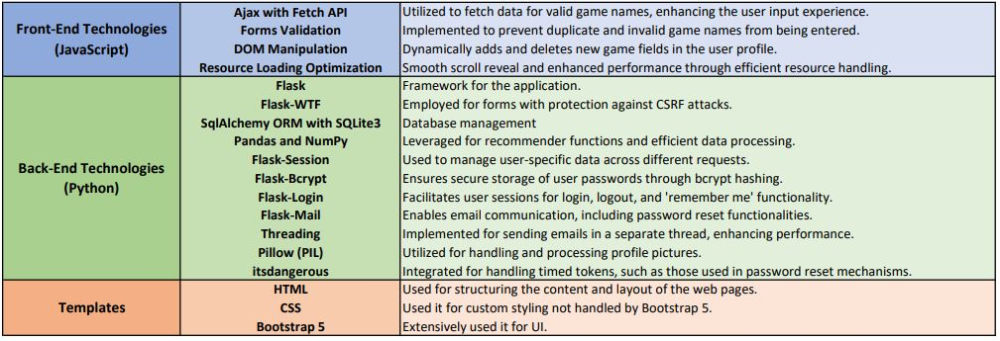
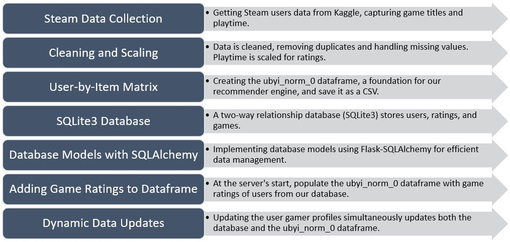
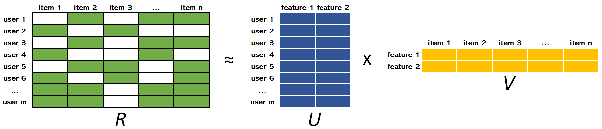

# Game Recommender: Gamer Insight 
Gamer Insight is a user-friendly game recommender app. It suggests games based on your favorite titles and the preferences of similar gamers/users. 

Discover new games that match your taste and enjoy a personalized gaming experience with Gamer Insight. Your recommendations are just a click away on [Gamer Insight](https://gamerinsight.pythonanywhere.com/).

**Total time spent:** ~160 hours (8 hr/day for 20 days)

## Technologies Used



## Data Workflow

Here's an overview of the data processing steps:



By maintaining a dynamic connection between user profiles, game ratings, and our recommender engine, we ensure that Gamer Insight evolves and improves over time. 

**As more users create their gamer profiles, our recommendation system becomes more robust, providing better insights into gaming preferences and enhancing the accuracy of our game suggestions.**


## Recommendation Engine

Our recommendation engine operates on Alternating Least Squares (ALS) model which uses Matrix Factorization detailed in this [YouTube video](https://www.youtube.com/watch?v=ZspR5PZemcs) and [article](https://towardsdatascience.com/recommendation-system-matrix-factorization-d61978660b4b). It is a simple and fast model belonging to the collaborative filtering type of recommendation systems.

The foundation of our engine is the `ubyi_norm_0` dataframe, a user-by-item matrix derived from [Steam user data](https://www.kaggle.com/datasets/tamber/steam-video-games). This matrix captures user-game interactions, where rows represent users, columns represent games, and values indicate game ratings.
Ratings are transformed using logarithmic scaling of playtime, resulting in a range of 1 to 10. Any missing values in the dataframe are replaced with 0 to facilitate model training.

Matrix factorization is basically taking a large matrix and factor it into smaller matrices whose product equals the original one. The matrix factorization mathematically reduces the original matrix "all users vs all items" into smaller matrices "all users vs some features" and "all items vs some features" where items represent game titles in our case. The mentioned features are learnt from the data and don't necessarily represent any real metadata.

ALS is then an iterative optimization process that tries to arrive to a closer and closer factorized representation (U x V) of the original matrix R at every iteration.



## Usage

If you only want to use it then go to [Gamer Insight](https://gamerinsight.pythonanywhere.com/) but if you want to run it locally (or in case the server is down) then follow these steps:

1. Clone the project:
  ```bash
  $ git clone https://github.com/Sohaib9920/Game_Recommender.git
  ```
2. Change current working directory:
  ```bash
  $ cd Game_Recommender
  ```
3. Create a virtual environment:
  ```bash
  $ python -m venv env
  ```
4. Activate the virtual environment:
  ```bash
  $ source env/Scripts/activate
  ```
5. Install the project requirements:
  ```bash
  $ pip install -r requirements.txt
  ```
6. Create `.env` file for environment variables:
  ```bash
  $ code .env
  ```
7. Add key:value pairs for environment variables in `.env`:
  ```
  SECRET_KEY=secret_key_of_your_app
  SQLALCHEMY_DATABASE_URI=sqlite:///site.db
  EMAIL_USER=your_gmail
  EMAIL_PASSWORD=app_password_of_your_gmail
  ```
  The last two environment variables are for reset_password feature. App password is obtained from your google account after 2-step-verification is enabled.
  If you find it a hassle then skip them and app will still run but without reset password functionality.
  
8. Run app using local server:
  ```bash
  $ python run.py
  ```

## Limitation
Due to un-availibility of latest data on steam user ratings, the game titles in this model are upto *year 2016*. You cannot input nor be recommended the latest games.

Anyone can contribute by updating the `ubyi_norm_0.csv` to include newer games. Everything else will remain the same. 

## Note:
I tried my best to remove any type of error and use resources as efficiently as possible but if there are still some errors or potential improvements you notice then please raise an issue or submit a pull request. 

